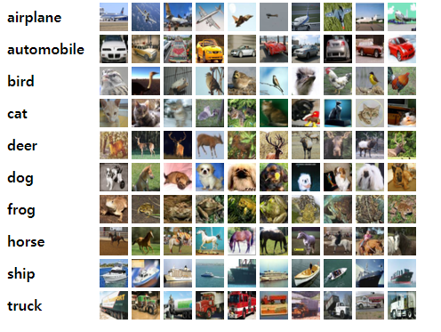
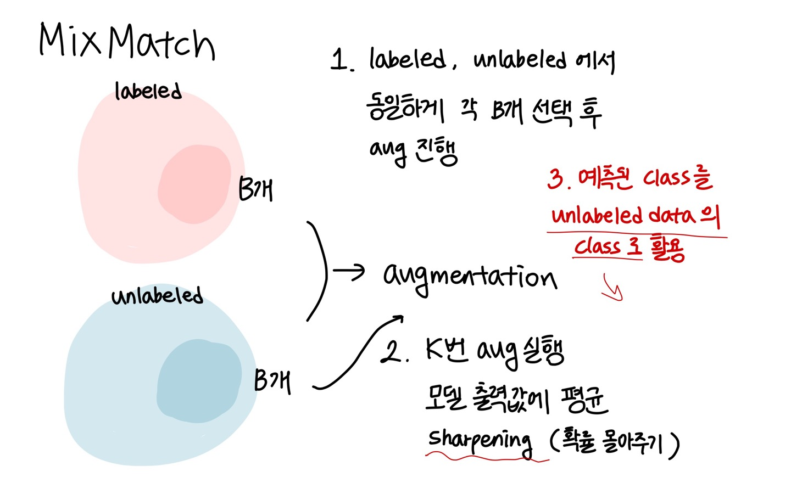
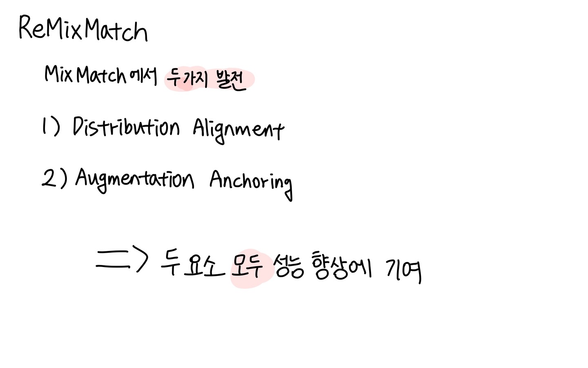
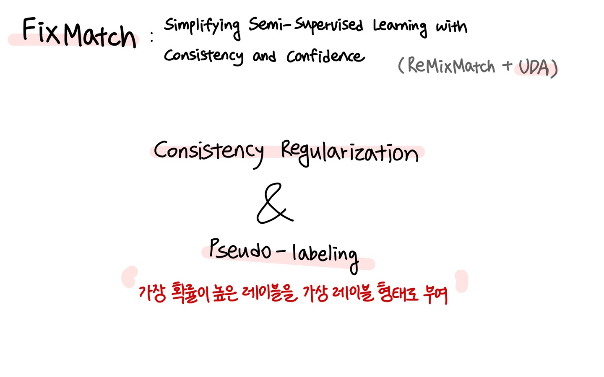
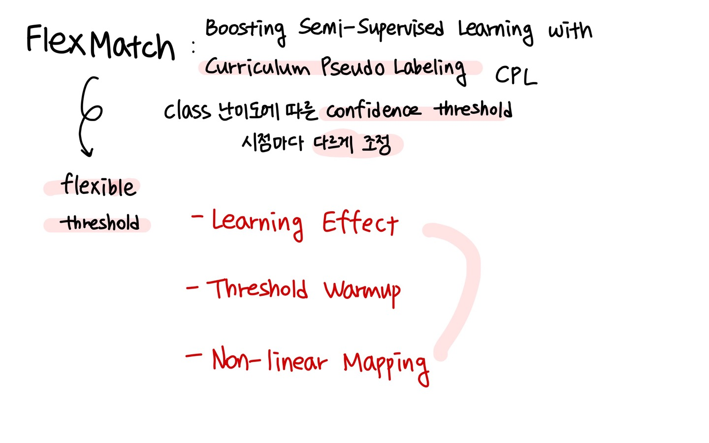

# Business-Analytics_5

## #MixMatch #ReMixMatch #FixMatch #FlexMatch 
## Tutorial Purposes
1. Apply semi-supervised algorithms from scratch to CIFAR-10 datasets. 
2. Understand how the algorithm works while implementing it. 
3. Compare the classification performance in each algorithm according to the labeled data of various proportions.
4. Compoare the classification performance among semi-supervised algoithms. 

## Datasets
### CIFAR10 Dataset
The CIFAR-10 dataset consists of 60000 32x32 colour images in 10 classes, with 6000 images per class. There are 50000 training images and 10000 test images.

The dataset is divided into five training batches and one test batch, each with 10000 images. The test batch contains exactly 1000 randomly-selected images from each class. The training batches contain the remaining images in random order, but some training batches may contain more images from one class than another. Between them, the training batches contain exactly 5000 images from each class.




## 1. MixMatch 


### 1-1. MixMatch Core Code

**Random crop & flip**
```

class RandomPadandCrop(object):
    def __init__(self, output_size):
        assert isinstance(output_size, (int, tuple))
        if isinstance(output_size, int):
            self.output_size = (output_size, output_size)
        else:
            assert len(output_size) == 2
            self.output_size = output_size
    
    def __call__(self, x):
        x = pad(x, 4)
        
        old_h, old_w = x.shape[1: ]
        new_h, new_w = self.output_size
        
        top = np.random.randint(0, old_h-new_h)
        left = np.random.randint(0, old_w-new_w)
        
        x = x[:, top:top+new_h, left:left+new_w]
        return x

# Random flip
class RandomFlip(object):
    def __call__(self, x):
        if np.random.rand() < 0.5:
            x = x[:, :, ::-1]
        
        return x.copy()
```

**Gaussian noise**
```
class GaussianNoise(object):
    def __call__(self, x):
        c, h, w = x.shape
        x += np.random.randn(c, h, w)*0.15
        return x
```

**Train MixMatch**
```
 for batch_idx in range(self.args.num_iter):
              
                try:
                    inputs_x, targets_x = iter_labeled.next()
                except:
                    iter_labeled = iter(self.labeled_loader)
                    inputs_x, targets_x = iter_labeled.next()
                real_B = inputs_x.size(0)

                # Transform label to one-hot
                targets_x = torch.zeros(real_B, 10).scatter_(1, targets_x.view(-1,1).long(), 1)
                inputs_x, targets_x = inputs_x.to(self.args.cuda), targets_x.to(self.args.cuda)

                try:
                    tmp_inputs, _ = iter_unlabeled.next()
                except:
                    iter_unlabeled = iter(self.unlabeled_loader)
                    tmp_inputs, _ = iter_unlabeled.next()

                inputs_u1, inputs_u2 = tmp_inputs[0], tmp_inputs[1]
                inputs_u1, inputs_u2 = inputs_u1.to(self.args.cuda), inputs_u2.to(self.args.cuda)

                with torch.no_grad():
                    outputs_u1 = self.model(inputs_u1)
                    outputs_u2 = self.model(inputs_u2)

                    pt = (torch.softmax(outputs_u1, dim=1)+torch.softmax(outputs_u2, dim=1)) / 2
                    pt = pt**(1/self.args.T)

                    targets_u = pt / pt.sum(dim=1, keepdim=True)
                    targets_u = targets_u.detach()
                
                inputs = torch.cat([inputs_x, inputs_u1, inputs_u2], dim=0)
                targets = torch.cat([targets_x, targets_u, targets_u], dim=0)

                l_mixup = np.random.beta(self.args.alpha, self.args.alpha)
                l_mixup = max(l_mixup, 1-l_mixup)

                B = inputs.size(0)
                random_idx = torch.randperm(B)

                inputs_a, inputs_b = inputs, inputs[random_idx]
                targets_a, targets_b = targets, targets[random_idx]

                mixed_input = l_mixup*inputs_a + (1-l_mixup)*inputs_b
                mixed_target = l_mixup*targets_a + (1-l_mixup)*targets_b

                
                mixed_input = list(torch.split(mixed_input, real_B))
                mixed_input = interleave(mixed_input, real_B)

                logits = [self.model(mixed_input[0])] # for labeled
                for input in mixed_input[1:]:
                    logits.append(self.model(input)) # for unlabeled

                logits = interleave(logits, real_B) 
                logits_x = logits[0]
                logits_u = torch.cat(logits[1:], dim=0)

                loss_x, loss_u, w = \
                    self.criterion_train(self.args,
                                    logits_x, mixed_target[:real_B],
                                    logits_u, mixed_target[real_B:],
                                    epoch+batch_idx/self.args.num_iter) # Semi-supervised loss 계산

                loss = loss_x + w * loss_u
```

### 1-2. MixMatch Results

**n_labeles=1024 & batch_size=64**
| epoch | loss               | test_acc_top1 | test_acc_top5 |
|-------|--------------------|---------------|---------------|
| 1     | 2.29610347623229   | 16.5          | 66.36         |
| 2     | 1.4692106358200312 | 47.56         | 92.74         |
| 3     | 0.9595073587344959 | 68.86         | 96.72         |
| 4     | 0.8246866593418642 | 73.8          | 97.06         |
| 5     | 0.7859846637746319 | 75.26         | 97.16         |
| 6     | 0.7534228073932231 | 76.88         | 97.12         |
| 7     | 0.733644444565475  | 77.86         | 97.36         |
| 8     | 0.7067113063082099 | 79.1          | 97.52         |
| 9     | 0.6955082983266562 | 79.38         | 97.58         |
| 10    | 0.6779901931811124 | 80.18         | 97.68         |
| 11    | 0.6649935487471521 | 80.6          | 97.76         |
| 12    | 0.6629698282167316 | 80.8          | 97.66         |
| 13    | 0.6547238179832697 | 81.1          | 97.7          |
| 14    | 0.6468452459834516 | 81.6          | 97.78         |
| 15    | 0.6338290903925896 | 82.24         | 97.94         |
| 16    | 0.6275453436262906 | 82.5          | 97.78         |
| 17    | 0.6250676169097423 | 82.14         | 97.94         |
| 18    | 0.624658720035851  | 82.38         | 98.1          |
| 19    | 0.6249328682448715 | 82.54         | 98.0          |
| 20    | 0.6184782047085464 | 82.96         | 98.06         |

The best top-1 acc is 82.96% 


**various batch size (n-labeled=1024)**
| batch_size | best top_1 acc  | best top_5 acc |
|------------|-----------------|----------------|
| 32         | 83.16           | 98.14          |
| 64         | 82.96           | 98.06          |
| 128        | 83.24           | 98.52          |
| 256        | 83.4            | 98.08          |
| 512        | 83.4            | 98.1           |

There is little difference in MixMatch's performance for batch size changes.

**various n-labeled size (batch size=64)**

| n-labeled | best top_1 acc  | best top_5 acc |
|------------|-----------------|----------------|
| 64         | 83.1            | 97.96          |
| 128        | 83.44           | 98.32          |
| 256        | 83.06           | 98.04          |
| 512        | 83.6            | 98.24          |
| 1024       | 82.96           | 98.06          |

There is little difference in MixMatch's performance for number of labeled dataset size changes.

## 2. ReMixMatch 


### 2-1. ReMixMatch Core Code

**distribution alignment**
```
 with torch.no_grad():
                    logits_x = self.model(inputs_x)
                    logits_tmp = self.model(inputs_u_w)
                    q = torch.softmax(logits_tmp,dim=1)
                    q = q * (torch.softmax(logits_x, dim=1)).mean()/q.mean()
            
                    pt = q**(1/0.5)
                    targets_u = pt / pt.sum(dim=1, keepdim=True)
                    pseudo_label = targets_u.detach()
                    
```

**augmentation anchoring**

```
class TransformReMixMatch(object):
    
    def __init__(self, mean=mean_cifar10, std=std_cifar10):
        
        self.weak_transform = transforms.Compose([
            transforms.RandomHorizontalFlip(),
            transforms.RandomCrop(size=32,
                                padding=int(32*0.125),
                                padding_mode='reflect')
        ])

        self.strong_transform = transforms.Compose([
            transforms.RandomHorizontalFlip(),
            transforms.RandomCrop(size=32,
                                padding=int(32*0.125),
                                padding_mode='reflect'),
            RandAugmentMC(n=2, m=10)
        ])

        self.normalize = transforms.Compose([
            transforms.ToTensor(),
            transforms.Normalize(mean=mean, std=std)
        ]) 
    
    
    def __call__(self, x):
        
        weak = self.weak_transform(x)
        strong = self.strong_transform(x)

        return self.normalize(weak), self.normalize(strong)
```

### 2-2. ReMixMatch Results

**n_labeles=1024 & batch_size=64**

| epoch | loss               | test_acc_top1 | test_acc_top5 |
|-------|--------------------|---------------|---------------|
| 1     | 2.222361757731438  | 19.76         | 68.92         |
| 2     | 1.370564011386037  | 53.38         | 94.22         |
| 3     | 0.9240604195334017 | 70.42         | 96.72         |
| 4     | 0.8171912197517232 | 74.4          | 96.82         |
| 5     | 0.7748386764685158 | 76.28         | 97.08         |
| 6     | 0.7364659563444554 | 77.7          | 97.36         |
| 7     | 0.702775410613045  | 79.16         | 97.46         |
| 8     | 0.6802817515067756 | 80.02         | 97.46         |
| 9     | 0.6560938054602593 | 80.82         | 97.86         |
| 10    | 0.6387544967809692 | 81.36         | 98.02         |
| 11    | 0.631149818315357  | 81.78         | 98.0          |
| 12    | 0.6230511305347085 | 82.06         | 98.26         |
| 13    | 0.6220373423960059 | 81.94         | 98.3          |
| 14    | 0.6167585715901106 | 82.3          | 98.12         |
| 15    | 0.6109964523572474 | 82.36         | 98.38         |
| 16    | 0.6148736979983747 | 82.24         | 98.28         |
| 17    | 0.6165377250127494 | 82.16         | 98.3          |
| 18    | 0.6042093914464116 | 82.86         | 98.14         |
| 19    | 0.5981170762196183 | 83.4          | 98.08         |
| 20    | 0.5964447246551514 | 83.28         | 98.0          |


**various batch size (n-labeled=1024)**

| batch_size | best top_1 acc  | best top_5 acc |
|------------|-----------------|----------------|
| 32         | 83.16           | 98.14          |
| 64         | 82.96           | 98.06          |
| 128        | 83.24           | 98.52          |
| 256        | 83.4            | 98.08          |
| 512        | 83.4            | 98.1           |

There is little difference in ReMixMatch's performance for batch size changes.

**various n-labeled size (batch size=64)**

| n-labeled | best top_1 acc  | best top_5 acc |
|------------|-----------------|----------------|
| 64         | 83.1            | 97.96          |
| 128        | 83.44           | 98.32          |
| 256        | 83.06           | 98.04          |
| 512        | 83.6            | 98.24          |
| 1024       | 82.96           | 98.06          |

There is little difference in ReMixMatch's performance for number of labeled 

## 3. FixMatch 


### 3-1. FixMatch Core Code

**augmentation functions**
```

def AutoContrast(img, **kwargs):
    return PIL.ImageOps.autocontrast(img)


def Brightness(img, v, max_v, bias=0):
    v = _float_parameter(v, max_v) + bias
    return PIL.ImageEnhance.Brightness(img).enhance(v)


def Color(img, v, max_v, bias=0):
    v = _float_parameter(v, max_v) + bias
    return PIL.ImageEnhance.Color(img).enhance(v)


def Contrast(img, v, max_v, bias=0):
    v = _float_parameter(v, max_v) + bias
    return PIL.ImageEnhance.Contrast(img).enhance(v)


def CutoutAbs(img, v, **kwargs):
    w, h = img.size
    x0, y0 = np.random.uniform(0, w), np.random.uniform(0, h)
    x0, y0 = int(max(0, x0 - v / 2.)), int(max(0, y0 - v / 2.))

    x1, y1 = int(min(w, x0 + v)), int(min(h, y0 + v))

    xy = (x0, y0, x1, y1)
    # gray
    color = (127, 127, 127)
    img = img.copy()
    
    PIL.ImageDraw.Draw(img).rectangle(xy, color)
    return img


def Cutout(img, v, max_v, bias=0):
    if v == 0:
        return img
    v = _float_parameter(v, max_v) + bias
    v = int(v * min(img.size))
    return CutoutAbs(img, v)


def Equalize(img, **kwargs):
    return PIL.ImageOps.equalize(img)


def Identity(img, **kwargs):
    return img


def Invert(img, **kwargs):
    return PIL.ImageOps.invert(img)


def Posterize(img, v, max_v, bias=0):
    v = _int_parameter(v, max_v) + bias
    return PIL.ImageOps.posterize(img, v)


def Rotate(img, v, max_v, bias=0):
    v = _int_parameter(v, max_v) + bias
    if random.random() < 0.5:
        v = -v
    return img.rotate(v)


def Sharpness(img, v, max_v, bias=0):
    v = _float_parameter(v, max_v) + bias
    return PIL.ImageEnhance.Sharpness(img).enhance(v)


def ShearX(img, v, max_v, bias=0):
    v = _float_parameter(v, max_v) + bias
    if random.random() < 0.5:
        v = -v
    return img.transform(img.size, PIL.Image.AFFINE, (1, v, 0, 0, 1, 0))


def ShearY(img, v, max_v, bias=0):
    v = _float_parameter(v, max_v) + bias
    if random.random() < 0.5:
        v = -v
    return img.transform(img.size, PIL.Image.AFFINE, (1, 0, 0, v, 1, 0))


def Solarize(img, v, max_v, bias=0):
    v = _int_parameter(v, max_v) + bias
    return PIL.ImageOps.solarize(img, 256 - v)


def SolarizeAdd(img, v, max_v, bias=0, threshold=128):
    v = _int_parameter(v, max_v) + bias
    if random.random() < 0.5:
        v = -v
    img_np = np.array(img).astype(np.int)
    img_np = img_np + v
    img_np = np.clip(img_np, 0, 255)
    img_np = img_np.astype(np.uint8)
    img = Image.fromarray(img_np)
    return PIL.ImageOps.solarize(img, threshold)


def TranslateX(img, v, max_v, bias=0):
    v = _float_parameter(v, max_v) + bias
    if random.random() < 0.5:
        v = -v
    v = int(v * img.size[0])
    return img.transform(img.size, PIL.Image.AFFINE, (1, 0, v, 0, 1, 0))


def TranslateY(img, v, max_v, bias=0):
    v = _float_parameter(v, max_v) + bias
    if random.random() < 0.5:
        v = -v
    v = int(v * img.size[1])
    return img.transform(img.size, PIL.Image.AFFINE, (1, 0, 0, 0, 1, v))

# Augmentation list for RandAugment
def fixmatch_augment_pool():
    
    augs = [(AutoContrast, None, None),
            (Brightness, 0.9, 0.05),
            (Color, 0.9, 0.05),
            (Contrast, 0.9, 0.05),
            (Equalize, None, None),
            (Identity, None, None),
            (Posterize, 4, 4),
            (Rotate, 30, 0),
            (Sharpness, 0.9, 0.05),
            (ShearX, 0.3, 0),
            (ShearY, 0.3, 0),
            (Solarize, 256, 0),
            (TranslateX, 0.3, 0),
            (TranslateY, 0.3, 0)]
    return augs
```

**loss function**
```
for batch_idx in range(self.args.eval_step): ### eval_step: 1024 // batch_size: 64
                
                try:
                    inputs_x, targets_x = iter_labeled.next()
                except:
                    iter_labeled = iter(self.labeled_loader)
                    inputs_x, targets_x = iter_labeled.next()
                real_B = inputs_x.size(0)
                
                try:
                    (inputs_u_w, inputs_u_s), _ = iter_unlabeled.next()
                except:
                    iter_unlabeled = iter(self.unlabeled_loader)
                    (inputs_u_w, inputs_u_s), _ = iter_unlabeled.next()
                
                inputs = torch.cat((inputs_x, inputs_u_w, inputs_u_s), dim=0).to(self.args.cuda)
                targets_x = targets_x.type(torch.LongTensor)
                targets_x = targets_x.to(self.args.cuda)
                
                logits = self.model(inputs)
                
                logits_x = logits[:real_B]
                logits_u_w, logits_u_s = logits[real_B:].chunk(2)
                del(logits)

                loss_x = F.cross_entropy(logits_x, targets_x, reduction='mean')
                pseudo_labels = torch.softmax(logits_u_w.detach()/self.args.T, dim=-1) 
                max_prob, targets_u = torch.max(pseudo_labels, dim=-1)
                mask = max_prob.ge(self.args.threshold).float() ##### mask: Threshold보다 크면 True, 작으면 False를 반환
                loss_u = (F.cross_entropy(logits_u_s, targets_u, reduction='none')*mask).mean()

                loss = loss_x + self.args.lambda_u * loss_u
```

### 3-2. FixMatch Results

**n_labeles=1024 & batch_size=64**

| epoch | loss               | test_acc_top1 | test_acc_top5 |
|-------|--------------------|---------------|---------------|
| 1     | 1.7162069663023338 | 39.383015     | 88.38141      |
| 2     | 0.9198864316328977 | 67.60817      | 97.59615      |
| 3     | 0.6716084610193204 | 76.32211      | 98.65785      |
| 4     | 0.5978961311853849 | 80.26843      | 98.9984       |
| 5     | 0.5880882413341448 | 81.8109       | 99.15865      |
| 6     | 0.5875925461833293 | 82.59215      | 99.15865      |
| 7     | 0.5880910228842344 | 83.3734       | 99.29888      |
| 8     | 0.5873083260196906 | 84.07452      | 99.25881      |
| 9     | 0.583181038307838  | 84.8758       | 99.379005     |
| 10    | 0.5833060982135626 | 85.33654      | 99.35897      |
| 11    | 0.5827269590435884 | 85.57692      | 99.39904      |
| 12    | 0.5720039902207179 | 85.777245     | 99.4992       |
| 13    | 0.5666739902435205 | 86.11779      | 99.41907      |
| 14    | 0.5565472495479461 | 86.097755     | 99.41907      |
| 15    | 0.5476892198889683 | 86.738785     | 99.4391       |
| 16    | 0.5413872771538221 | 87.17949      | 99.51923      |


**various batch size (n-labeled=1024)**

| batch_size | best top_1 acc  | best top_5 acc |
|------------|-----------------|----------------|
| 32         | 86.83894         | 99.41907      |
| 64         | 87.17949         | 99.51923      |
| 128        | 87.21955         | 99.39904      |
| 256        | 87.01923         | 99.53926      |
| 512        | 86.9391          | 99.4391       |

There is little difference in FixMatch's performance for batch size changes.

**various n-labeled size (batch size=64)**

| n-labeled | best top_1 acc  | best top_5 acc |
|------------|-----------------|----------------|
| 64         | 83.1            | 97.96          |
| 128        | 87.54006           | 99.59936          |
| 256        | 87.25961           | 99.51923         |
| 512        | 87.39984            | 99.37901          |
| 1024       | 87.17949           | 99.4391          |

There is little difference in FixxMatch's performance for number of labeled 


## 4. FlexMatch 



### 4-1. FlexMatch Core Code

**threshold warmup**

```
 logits = self.model(inputs) 
                
                
                logits_x = logits[:real_B]
                logits_u_w, logits_u_s = logits[real_B:].chunk(2)
                del(logits)
                loss_x = F.cross_entropy(logits_x, targets_x, reduction='mean')

                pseudo_labels = torch.softmax(logits_u_w.detach()/self.args.T, dim=-1) 
                max_prob, targets_u = torch.max(pseudo_labels, dim=-1)
                mask = torch.tensor([max_prob[idx].ge(self.c_threshold[idx]).float() for idx in targets_u])
                
                for mask_value, class_idx in zip(mask, targets_u):
                    if mask_value == 0:
                        under_threshold_count += 1

                    elif mask_value == 1:
                        over_threshold_count[class_idx] += 1

                logits_u_s = logits_u_s.to(self.args.cuda)
                targets_u = targets_u.to(self.args.cuda)
                mask = mask.to(self.args.cuda)
                loss_u = (F.cross_entropy(logits_u_s, targets_u, reduction='none')*mask).mean()
                
                loss = loss_x + self.args.lambda_u * loss_u
```

### 4-2. FlexMatch Results

**n_labeles=4000 & batch_size=64**
| epoch | loss                | test_acc_top1 | test_acc_top5 |
|-------|---------------------|---------------|---------------|
| 1     | 1.6819152205418317  | 38.501602     | 91.88702      |
| 2     | 1.0575591172927465  | 62.159454     | 96.91506      |
| 3     | 0.7371621001989414  | 74.45914      | 98.35737      |
| 4     | 0.6102756735606071  | 79.32692      | 98.778046     |
| 5     | 0.5599613820131009  | 81.65064      | 99.01843      |
| 6     | 0.5408329484172356  | 82.99279      | 99.17869      |
| 7     | 0.5306563239831191  | 83.854164     | 99.21875      |
| 8     | 0.518273243919397   | 85.05609      | 99.31891      |
| 9     | 0.5119977671748552  | 85.09615      | 99.39904      |
| 10    | 0.5061291813468322  | 85.8774       | 99.4391       |
| 11    | 0.49637412547301024 | 86.29808      | 99.51923      |
| 12    | 0.4874531267545162  | 86.698715     | 99.45914      |

**various batch size (n-labeled=4000)**

| batch_size | best top_1 acc  | best top_5 acc |
|------------|-----------------|----------------|
| 32         | 87.25961       | 99.47916      |
| 64         | 87.13942         | 99.4992      |
| 128        | 86.87901        |   99.4992    |
| 256        | 87.68029        | 99.57933     |
| 512        | 87.15945          | 99.53926      |

There is little difference in FlexMatch's performance for batch size changes.

**various n-labeled size (batch size=64)**

| n-labeled | best top_1 acc  | best top_5 acc |
|------------|-----------------|----------------|
| 64         | 88.02084       | 99.59936          |
| 128        | 87.29968        | 99.65945          |
| 256        | 87.22955  | 99.5 903    |
| 512        | 85.09615        | 99.39904          |
| 1024       | 86.69872          | 99.45914          |

There is little difference in FlexxMatch's performance for number of labeled.

## Conclusion

Overall, every semi-supervsied learning algorithms showed high classification performance on CIFAR-10 dataset. However, the latest model, flexmatch recorded the highest classification accuracy among them. 

Interestingly, changes in batch size and the number of labeled dataset did not cause significant changes in the performance of each model. It is assumed that those models already have good classification performance.It is expected that a clearer comparison will be possible if experiments are conducted on datasets other than CIFAR-10, which is already widely used.